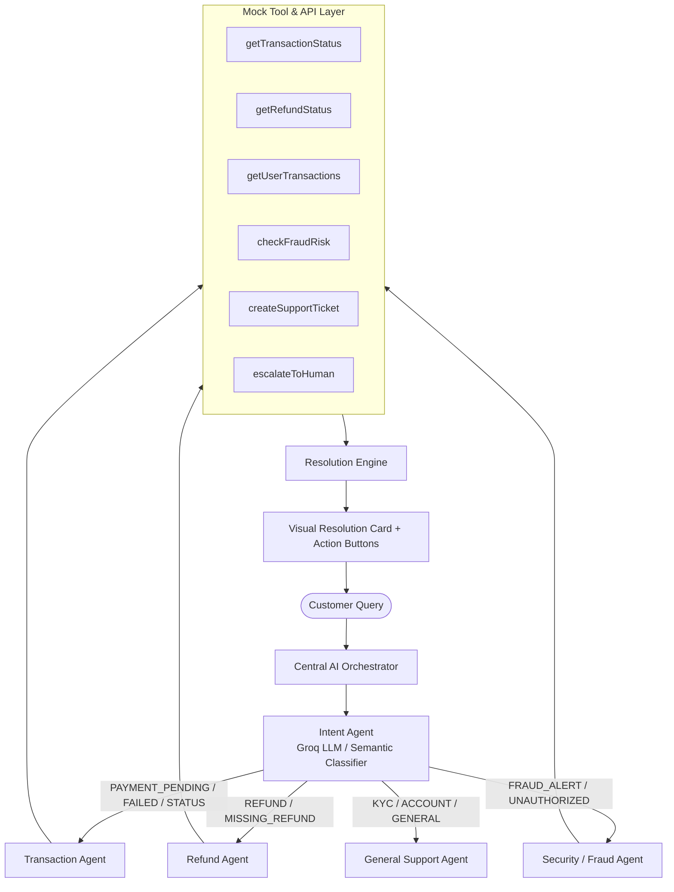

# ResolveAI - Multi-Agent AI Customer-Support & Automated Issue Resolution

**Built for the Paytm Build for India AI Hackathon**

ResolveAI is an enterprise-grade customer support and issue-resolution platform powered by a **modular multi-agent AI architecture**. Instead of relying on a single, monolithic LLM prompt that suffers from hallucination and prompt drift, ResolveAI routes user queries through specialized autonomous agents equipped with tools to query live payment ledgers, verify refund lifecycles, assess fraud risks, and escalate to human specialists when necessary.

---

## 1. Problem Statement

Payment and fintech platforms handle millions of queries daily—spanning pending UPI transactions, failed merchant debits, delayed refunds, and unauthorized fraud disputes. Traditional solutions face distinct failure modes:
- **Rule-based chatbots**: Frustrate customers with rigid keyword matching and dead-end menus.
- **Single-prompt LLMs**: Prone to hallucinating bank balances, misquoting NPCI clearing rules, or taking non-deterministic actions on financial queries.
- **Customer fatigue**: Repetitive explanations and long wait times for human support.

---

## 2. Solution: Modular Multi-Agent AI System

ResolveAI decouples the resolution lifecycle into specialized agents and tools:



---

## 3. Specialized AI Agents

| Agent | Responsibility | Authorized Tools | Typical Output |
| :--- | :--- | :--- | :--- |
| **Intent Agent** | Semantic intake, intent classification, entity extraction (Txn ID, amount, merchant), confidence scoring | NLP Classifier, Regex Entity Parser | Intent Category (`PAYMENT_PENDING`), Confidence (`0.96`), Target Agent |
| **Transaction Agent** | Handles failed, pending, reversed, and completed transactions | `getTransactionStatus()`, `getUserTransactions()` | Clearing explanation, NPCI reconciliation timelines, fund recovery reassurance |
| **Refund Agent** | Validates refund lifecycles, timelines, and proof of refund | `getRefundStatus()`, `getTransactionStatus()` | Bank Reference Number (RRN), credit destination account, arrival ETA |
| **Security/Fraud Agent**| Detects suspicious activity, unauthorized reports, risk scoring | `checkFraudRisk()`, `createSupportTicket()`, `escalateToHuman()` | Risk rating (Critical 92/100), automated Priority HIGH ticket (`RA-10293`), human escalation |
| **General Support Agent** | Handles KYC upgrades, wallet limits, FAQs | `createSupportTicket()`, `getUserTransactions()` | Paperless Video KYC steps, Aadhaar OTP instructions |

---

## 4. Key Features

- **Decoupled Multi-Agent Routing**: Independent agents prevent prompt pollution and ensure domain-specific safety boundaries.
- **Deterministic Tool Calling**: Agents ground answers in ledger records rather than generating financial data from memory.
- **Interactive Multi-Agent Step Visualizer**: Displays live step-by-step progress (*"Understanding your issue..."* → *"Routed to Transaction Agent"* → *"Tool: getTransactionStatus('TXN1002')"* → *"Resolution Synthesized"*).
- **Structured Resolution Cards**: Displays transaction reference, ₹ amount, settlement state, and direct action triggers (*View Transaction*, *Create Support Ticket*, *Talk to Human*).
- **Confidence Scoring & Human Escalation**: Automatic fallback when confidence < 0.65 or when high-risk fraud triggers are identified.
- **Admin Operations Dashboard**: Live resolution rate, average response latency, agent workload distribution, issue categories, and support ticket triage.
- **Demo Ledger Explorer**: Search and filter simulated Paytm transactions (`TXN1001` to `TXN1008`) with 1-click test in AI chat.
- **Live 3-Minute Hackathon Demo Flow**: 1-click buttons for judge evaluation.

---

## 5. Technology Stack

- **Frontend**: React 19, TypeScript, Tailwind CSS, Lucide React, Recharts, Motion
- **Backend & Server**: Node.js, Express, tsx, esbuild
- **AI / LLM Integration**: Groq API (`llama-3.3-70b-versatile`) with server-side proxying and Gemini API (`gemini-2.5-flash`) fallback
- **Database Architecture**: Relational models mapped to Prisma ORM (`prisma/schema.prisma`) with an in-memory high-fidelity repository layer (`lib/db/store.ts`)

---

## 6. Environment Variables

Create or configure `.env` based on `.env.example`:

```env
# Groq API Key (Server-Side Only)
GROQ_API_KEY="your_groq_api_key_here"

# Google Gemini API Key (Optional / Fallback)
GEMINI_API_KEY="your_gemini_api_key_here"

# App URL
APP_URL="http://localhost:3000"
```

> **Security Note**: API keys are strictly retained on the Express backend server and never sent to client-side code.

---

## 7. Installation & Running Locally

```bash
# 1. Clone the repository
git clone https://github.com/example/resolveai.git
cd resolveai

# 2. Install dependencies
npm install

# 3. Start development server
npm run dev

# App will run at http://localhost:3000
```

---

## 8. 3-Minute Hackathon Live Demo Flow

Use the quick demo buttons on top of the chat interface:

1. **Demo 1: Pending Payment**
   - Prompt: *"My payment of ₹499 is still pending."*
   - Flow: Intent Agent classifies `PAYMENT_PENDING` (96% confidence) → routes to **Transaction Agent** → queries `getTransactionStatus('TXN1002')` → provides NPCI clearing timeline explanation and resolution card.

2. **Demo 2: Unauthorized Fraud Dispute**
   - Prompt: *"I think someone made an unauthorized transaction of ₹5000."*
   - Flow: Intent Agent flags `FRAUD_ALERT` → routes to **Security/Fraud Agent** → runs `checkFraudRisk()` (Score: 92/100 Critical) → creates urgent ticket `#RA-10293` → auto-escalates to Human Fraud Operations desk.

3. **Demo 3: Missing Refund Status**
   - Prompt: *"My refund for Flipkart TXN1004 has not arrived yet."*
   - Flow: Intent Agent classifies `REFUND` → routes to **Refund Agent** → executes `getRefundStatus('TXN1004')` → confirms credit completed with Bank Reference Number (RRN-948201948210).

---

## 9. API Documentation

| Method | Endpoint | Description |
| :--- | :--- | :--- |
| `POST` | `/api/chat` | Main orchestration endpoint. Processes query and returns resolution. |
| `POST` | `/api/resolve` | Updates support ticket status or records resolution. |
| `GET` | `/api/transactions` | Retrieves all simulated transactions in the ledger. |
| `GET` | `/api/transactions/:id` | Retrieves single transaction details by ID. |
| `GET` | `/api/refunds/:id` | Retrieves refund status and RRN by transaction reference. |
| `POST` | `/api/support-ticket` | Creates a new human escalation ticket. |
| `GET` | `/api/support-tickets` | Lists all open and resolved support tickets. |
| `GET` | `/api/dashboard` | Aggregates real-time stats, resolution rates, and telemetry logs. |
| `GET` | `/api/demo/scenarios` | Returns preset demo scenarios for hackathon evaluation. |
| `POST` | `/api/reset-demo` | Resets ledger and tickets back to pristine seed state. |

---

## 10. Future Improvements

- Voice-to-text integration for multilingual regional language support (Hindi, Tamil, Telugu, Bengali).
- Soundbox transaction audio confirmation webhook integration.
- Direct NPCI UPI dispute API webhooks for automated chargeback submission.
- Real-time agent collaboration (e.g. Transaction Agent passing context to Security Agent in a single multi-turn resolution).
# ResolveAI
